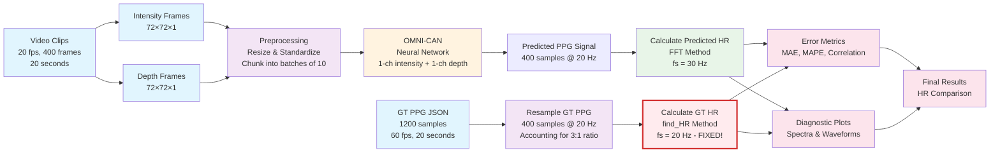

# rPPG Inference Pipeline - Mermaid Diagram

## Key Features:

### 🔄 **Data Flow**
- **Input**: Video clips with intensity/depth frames
- **Processing**: Preprocessing and neural network inference
- **Output**: Heart rate predictions and evaluation metrics

### ⚡ **Sampling Rate Handling**
- **Original GT**: 1200 samples @ 60 Hz
- **Resampled GT**: 400 samples @ 20 Hz (3:1 ratio)
- **Video**: 400 frames @ 20 Hz
- **Predicted**: 400 samples @ 20 Hz

### 🛠️ **Key Fix Applied**
- **Ground Truth HR**: Now uses `fs = 20 Hz` (was incorrectly `fs = 30 Hz`)
- **Predicted HR**: Uses `fs = 30 Hz` (unchanged)
- **Result**: Realistic GT HR values for proper evaluation

### 📊 **Outputs**
- **Error Metrics**: MAE, MAPE, Pearson correlation
- **Diagnostic Plots**: Frequency spectra and time-domain waveforms
- **HR Comparison**: Predicted vs Ground Truth heart rates

### 🎯 **Model Performance**
- **OMNI-CAN**: Processes 1-channel intensity + 1-channel depth
- **Input Size**: 72×72×1 for both intensity and depth
- **Batch Processing**: Chunks of 10 frames for temporal modeling
